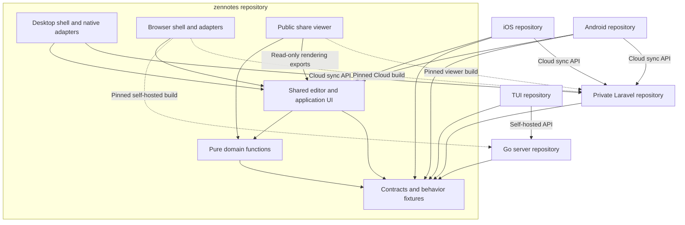

# ZenNotes ecosystem boundaries and repository plan

**Status:** Local boundary implementation and cross-client validation are complete on `refactor/ecosystem-boundaries`. Publication, account-backed staging validation, destination import, and channel cutover remain gated. Nothing has been staged, committed, pushed, or deployed by this work.
**Date:** September 15, 2026

## 1. Recommendation

Keep desktop, web, and their shared editor in `ZenNotes/zennotes`. Keep the existing iOS, Android, TUI, and private Laravel repositories. Make the Go self-hosted server independently testable and releasable inside the current repository, then extract it into one new public repository, `ZenNotes/znserver`, the destination selected by the maintainer.

The intended result is **six repositories, with explicit package, artifact, and API boundaries**. Five contain the existing product source; the maintainer has also created the empty `ZenNotes/znserver` destination. A separate repository for every shared library would add release coordination before delivering useful isolation.

### Execution record

| Slice | Local status and evidence |
| --- | --- |
| P0 ownership and provenance | Six repository owners documented. Historical viewer `c534a1d0` reproduced 67 of 73 old payload files; six differences prevent claiming exact old-byte provenance. The maintained replacement has separate browser proof; the old Laravel bundle remains available. |
| P0/P3 shared behavior | The same exact-byte task fixtures pass in TypeScript, Go server, and TUI, including near-midnight dates in Los Angeles and Auckland. Go/TUI consume versioned fixture copies with SHA-256 provenance. |
| P1 dependency graph | Contracts own portable types and `ZenPlatform`; domain depends on contracts, never the reverse. Compatibility exports remain. CI rejects Node globals and reverse imports. Pure rename/demo helpers belong to shared-domain. |
| P1 public host APIs | Navigation, notes/batches, folder/database actions, tasks, settings, commands, dialogs, immutable shell/workspace observations, editor commands/attachments/geometry, and host capabilities are implemented. Public exports do not expose store or CodeMirror internals. |
| P1 lifecycle guarantees | Mutations drain pending writers and protect late edits. Vault transitions invalidate captured host contexts monotonically, including cancelled/failed transitions. Native vault moves reserve save/move/reopen/rollback as one operation; failed rollback enters recovery state. |
| P2 portable packages | Core `2.50.4-core.h8a09555824b619b5` and its exact companion packages pass standalone nested installs, typechecks, Vite 6 and Vite 8 builds, and 50 real-browser checks per version. Assets, WASM, fonts, and React/CodeMirror/Lezer identity are verified. |
| P2 Android | Source cloning/private imports removed. A clean source-only consumer installs vendored immutable packages and passes 138 tests, types, web/native builds, four instrumentation tests, 20 emulator runtime checks, and three cold-start checks. SAF absence, directories, revoked access, provider failure, and exact bytes have native provider coverage. |
| P2 iOS | Same package boundary, 102 tests, clean web/native simulator builds, 20 runtime and three cold-start checks. Native preferences initialize before the editor; whole-vault rename/reopen and stale attachment contexts are covered. Existing unrelated Xcode project edits remain unchanged. |
| P3 TUI | Task and HTTP fixtures adopted without changing runtime ownership. Root/prefixed HTTP contracts pass against the actual Go binary; all TUI tests, vet, and build pass. |
| P3 Go/web artifact | Go tests need Go alone. Strict Go importer verifies protocol, source, archive/file hashes, tar paths/types, and immutable output. Web `2.50.4-web.hffc8c055ae2667f2` builds into the extracted module without Node or frontend source. |
| P3 Laravel/viewer | Viewer `2.50.4-viewer.h475ea70770234498` renders actual Laravel share/publication payloads. Seventeen focused Pest tests (141 assertions), eleven importer tests, and six Chrome cases pass after the v2.50.4 integration. Static license, normal document scrolling, safe fallback, published themes, and lazy diagrams are verified. Unsafe interactive plot libraries are excluded from the public bundle. |
| P3 artifact retention | Laravel installs current and explicitly retained manifests on every fresh deployment. Old lazy assets do not depend on a persistent build filesystem. Invalid/dirty pins fail normal release installation; the current candidate requires explicit local flags. |
| P4 source/history rehearsal | Fresh extracted source uses `github.com/ZenNotes/znserver`. A git-filter-repo 2.47.0 dry run processed 979 commits (160 touching server paths) without changing original or scratch refs or creating rewritten commits. |
| P4 distribution rehearsal | Go-only Docker arm64/amd64 builds pass root and prefixed auth/assets/exact writes/logout. Released v2.50.4 -> candidate -> released v2.50.4 preserves exact fixture bytes on both mounts. Go-only Nix arm64 Linux build and authenticated runtime read/write pass. |
| Release preparation | Candidate CI, manual draft artifact releases, and destination Go/Docker/Nix/binary release templates are prepared and actionlint-checked. Dirty-source release rejection and local release assembly are verified. No publisher was enabled or dispatched. |

[Consolidated local evidence](../../dist/ecosystem-boundary-validation/VALIDATION.md)
contains manifests, native/browser reports, screenshots, and logs. The final
workspace check passes all eight typecheck tasks. The full source suites pass
4,806 tests with five existing skips; the desktop build and CLI-without-node_modules
check pass. The production dependency audit reports no advisories. The full Laravel suite
passes 793 tests (6,272 assertions); its deployment safeguard still requires all
quality gates unconditionally while retaining failure evidence.

The native runtime fixture verifies exact Unicode/trailing-space persistence,
Find, tasks, attachments, note rename, Trash/Restore with comments, whole-vault
rename/reopen, stale context rejection, and cold start. Real account-backed
Cloud sync and iCloud entitlements were not exercised; they require an isolated
staging account/device. No personal or production vault was used.

The npm registry has no authenticated publishing identity on this machine;
`@zennotes` scope ownership remains unverified. Immutable archives vendored in the
mobile repositories are the interim transport, so clean mobile checkouts do not
need a sibling checkout or unpublished registry packages. Configure registry
publication only after ownership is verified. GitHub draft artifact publication
is prepared separately and remains approval-gated.

The current branch began at v2.50.3 and now includes the released v2.50.4 source
from `850cf5f8a7f7e10d3f47df1c5732209d8e0c2dcc` through a local three-way
reconciliation. Git HEAD and the pre-existing index remain unchanged. See the
[integration record](../v2.50.4-boundary-integration.md). Read-only release inventory
shows desktop v2.50.4, Android v1.1.20, and TUI v0.1.0; iOS has no GitHub releases. Checkout iOS
version 1.9.10/build 21 is not proof of App Store availability. Preserve all existing
protocol routes and compatibility exports until an installed-client support policy
is explicitly approved. A newer release is not permission to deprecate older apps.

See [the publication/cutover runbook](../boundary-release-cutover.md) for review
groups, release ordering, retained assets, and rollback.

### Remaining work in order

1. **Approve a source checkpoint.** The exact released v2.50.4 changes have been
   reconciled locally, and affected source/package/native/browser/distribution
   checks pass. Review the existing index and focused migration groups before
   committing or aligning branch history with the release. Do not publish the
   current dirty candidates as release artifacts.
2. **Run account-backed staging acceptance.** Use dedicated iCloud/Cloud fixtures
   to verify real entitlement, account-switch, revocation, and sync behavior. The
   local adapter/native storage checks do not replace these account-specific gates.
3. **Publish reviewed clean artifacts and update consumer pins.** Approve commits
   and publication; configure protected release environments. Rebuild at approved
   source SHAs, validate the clean candidates, publish the reviewed drafts, and
   replace local mobile/Laravel/server pins. Laravel's normal CI intentionally
   rejects the current dirty pin with no release URL. Run its actual viewer gate
   before enabling the install command in production's build configuration.
4. **Import Go history and run destination CI.** The empty `ZenNotes/znserver`
   destination is verified, and local extraction/build templates are ready. Actual
   rewritten history/import, repository security settings, publisher credentials,
   and fresh remote runner checks require approval. Linux Nix runtime is proven;
   macOS Nix remains part of the remote/platform matrix.
5. **Switch distribution ownership once.** Publish a verified destination release,
   disable the old Docker publisher before enabling the new one, move the server
   Nix source pin, then remove the old server source/workspace wrappers. Preserve
   desktop packaging. Keep rollback binaries/manifests and test open browser tabs
   through the chosen deployment rollout; a single Go binary does not retain all
   prior lazy assets automatically.

These are explicit release/cutover gates, not completed work. The global user rule
requires approval before committing or pushing; the local-only instruction also
precludes publication/deployment now. The migration cannot honestly be called
fully rolled out until those gates pass.

Cloud browser login and online editing (Phase 5) remain a separate product stream,
as agreed earlier. They are enabled by these boundaries but are not a prerequisite
for the Go split, and are not implemented by this migration.

### Outcomes

- Editor changes have one source and can reach desktop, browser, and mobile through deliberate dependency updates.
- Each product can build, test, release, and roll back without checking out another repository's private source tree.
- Native behavior stays with the native application that owns it.
- Existing Markdown vaults, Cloud revisions, published links, command names, and distribution channels keep working.
- Shared behavior is verified across TypeScript, Go, and PHP without forcing them to use the same implementation language.

This plan does not require a framework rewrite, a vault format migration, new microservices, merging the two backends, or adding Cloud support to the TUI. Keep the current Capacitor versions during the boundary work.

## 2. Current ecosystem and evidence

The inspected ecosystem has five clients: desktop, browser, iOS, Android, and TUI. It has two backends: the Go self-hosted server and Laravel Cloud. The website and account portal are also in Laravel.

| Repository | Current responsibility | Inspected commit |
| --- | --- | --- |
| `ZenNotes/zennotes` | Desktop, web, shared TypeScript, Go server | `a8fc4fc9a954c107b2fe4d6a4433c53702b01b13` |
| `ZenNotes/website` (private) | Laravel website, accounts, billing, Cloud, publishing | `652dbb19b4891f05d421401fb3b108cb4582b2da` |
| `ZenNotes/zennotesios` | Capacitor iOS shell and native integrations | `9971018286cd371f90d7afb882e46d8be3afde50` |
| `ZenNotes/zennotesandroid` | Capacitor Android shell and native integrations | `50c31dcb6ad7799f146cbe45ec6627181cda562f` |
| `ZenNotes/tui` | Go TUI, standalone `zn` CLI, MCP, local/remote adapters | `3ccdc81547780eeee325eb1e4b8b09dc85d17f28` |

These are source snapshots, not necessarily every deployed version. iOS also has an existing local change to `ios/App/App.xcodeproj/project.pbxproj`; preserve it during future work.

### Initial coupling inventory (before implementation)

1. **Mobile builds depend on another repository's layout.** At the initial inventory, both `tooling/prepare-zennotes.sh` scripts cloned the main repository at `.zennotes-commit`. Vite and TypeScript aliases reach into its source. Both mobile vault adapters import `demo-tour-data` and `wikilink-rename` from desktop main-process source.
2. **Shared packages do not yet form a one-way dependency graph.** `shared-domain` depends on `bridge-contract`, while `bridge-contract/src/bridge.ts` imports domain types. The public bridge also exposes `NodeJS.Platform`.
3. **Mobile shells use app-core internals.** They import the store through undeclared package subpaths and directly access state, actions, and editor references. `app-core` currently declares only the `./main` export.
4. **Package builds are source checks, not independently consumable releases.** The core packages are private and build with `tsc --noEmit`. `shared-ui` currently has an empty export, so it is not an existing component library to reorganize around.
5. **Go testing is coupled to frontend preparation.** `run-go-server-test.mjs` prepares the web distribution before running Go tests. Production embeds `web/dist`; Docker builds both stacks from the workspace. Root CI runs a combined production build, although desktop distribution scripts are already scoped to desktop.
6. **The TUI has a good adapter boundary but duplicated rules.** Its `Backend` interface already separates local and remote operations. Its vault types explicitly reference copies of behavior from desktop, shared-domain, and the Go server.
7. **The public share viewer lacks a current reproducible source path.** Laravel tracks a built viewer under `public/vendor/share-viewer`. The main repository has historical viewer source at `c534a1d0`, but no currently tracked `apps/share-viewer` source. Historical source must be verified against the deployed payload and bundle before being treated as the replacement.
8. **Cloud and self-hosted web are different integrations.** Today's web bridge talks to Go. Laravel's sync endpoints expect personal access tokens and active devices. Its browser login is a separate session flow. The existing web service worker also caches same-origin successful GET responses outside its `api/` exclusion, which is unsuitable as a default policy for authenticated Cloud content.

## 3. Target repository ownership

| Repository | Owns | Consumes | Release responsibility |
| --- | --- | --- | --- |
| `ZenNotes/zennotes` | Desktop shell; browser shell; shared editor, domain rules, contracts; restored public viewer source | Platform libraries and public dependencies | Desktop installers/updater; core packages; web and viewer artifacts; fixture releases |
| `ZenNotes/znserver` (selected destination) | Go self-hosted API, auth, filesystem access, watcher, server configuration | Pinned self-hosted web artifact; protocol fixtures | Go binary, self-hosted Docker image, server packaging |
| `ZenNotes/website` (existing, private) | Laravel Cloud, account portal, billing, marketing, docs, public shares/publications | Pinned Cloud web and public viewer artifacts | Laravel deployment and Cloud API compatibility |
| `ZenNotes/zennotesios` | iOS app lifecycle, filesystem/iCloud, keychain, native UI, widgets, mobile integration | Versioned core packages and contract fixtures | iOS release |
| `ZenNotes/zennotesandroid` | Android lifecycle, storage access framework, secure storage, native UI, widgets, mobile integration | Versioned core packages and contract fixtures | Android release |
| `ZenNotes/tui` | Terminal UI, standalone CLI/MCP, local and self-hosted adapters | Versioned format/protocol fixtures; optional later pure Go library | TUI/CLI binaries and existing package channels |

Keep the Laravel repository private. Public contracts and browser assets can be released from the public application repository without exposing Laravel implementation or deployment configuration. Keep marketing and Cloud in the same Laravel application unless a concrete ownership or deployment constraint later justifies separating them.

### Dependency map

Solid arrows describe dependencies or communication. Dotted arrows are build artifacts delivered to another repository.

Cross-repository source dependencies in this diagram are versioned packages or fixture archives. They are never imports into a sibling checkout. Browser builds execute in the browser and call their chosen backend over HTTP; Laravel and Go serve the assets, not the editor runtime.

## 4. Code boundaries inside the main repository

Keep existing package names during migration. Renaming folders is not a prerequisite.

| Layer | Allowed responsibilities | Boundary rule |
| --- | --- | --- |
| `bridge-contract` | Passive shared types, capabilities, host operation interfaces, separately named wire DTOs | No imports from app-core, domain implementations, Electron, Node, Capacitor, or Laravel source |
| `shared-domain` | Markdown/task/path/rename rules, portable configuration logic, pure transformations | Can import contracts; platform I/O enters through an explicit interface |
| `app-core` | Editor, note navigation, feature UI and orchestration | Calls host interfaces; never directly owns OS paths, native credentials, or server storage |
| `apps/desktop` | Electron IPC, windows, local filesystem, shortcuts, native integrations | Implements host interfaces and validates renderer input at the privileged boundary |
| `apps/web` | Browser bootstrap, HTTP adapters, browser session state, service worker | Chooses self-hosted or Cloud adapter explicitly; reports actual capabilities |
| Mobile repositories | Native adapters and mobile interaction shell | Import declared package exports; no desktop source aliases or arbitrary store mutation |

### Migration rules

- Move passive type definitions out of the current type cycle one type family at a time. Leave temporary re-exports in their previous locations to avoid changing every consumer together.
- Replace public Node-specific types with platform-neutral values. Represent operating system and host kind separately where needed. Audit mobile capability reporting instead of assuming that all non-desktop hosts are equivalent.
- Divide the large bridge into coherent interfaces such as vault operations, platform services, and Cloud sync. Preserve the existing `window.zen` facade while migrating implementations; a namespace rewrite is unnecessary.
- Add small, intentional app-core exports for navigation actions, state selectors, editor commands, and host extension hooks. Do not solve deep imports by exporting every store field.
- Give the public viewer a read-only rendering entrypoint with no editor bootstrap, authenticated session, or privileged host dependency. Confirm its required exports during source recovery before creating another package.
- Move pure wikilink rename logic to shared-domain and reusable demo data to a documented package subpath. Keep filesystem traversal and native writes in each host.
- Keep iOS iCloud and Android storage access implementations separate. Preserve Android's asynchronous native preference restoration before importing app-core.
- Preserve lazy loading for heavy editor features and one compatible instance of React, Zustand, and CodeMirror per app. Validate peer dependencies and asset inclusion in real consumer builds.
- Enforce dependency directions and forbidden imports in CI after each family has migrated. Temporary compatibility exceptions need an owner and removal task.

### Mobile integration findings for the next slices

The September 15 local review identified these requirements before P2.3/P2.4:

- Install the Home guard before React or other store subscribers. Preserve native
  preference restoration before importing any app-core runtime entrypoint.
- Adopt the verified `@zennotes/app-core/editor` attachment API during native
  package migration. Both current native helpers capture a note path before a
  picker but reacquire the active editor after asynchronous imports; they also
  resolve the active vault separately for each file. Capture the insertion target
  and bind the host importer to one vault before the picker. Keep module-owned
  picker lifetime and native keyboard behavior, cancel on disposal, and show
  recovery guidance for `saved-only` or partially failed imports.
- Adopt the verified `runEditorCommand` and `hasEditorSelection` exports. Keep
  CodeMirror views, mutable store state, and pane-layout serialization private.
  Retain DOM selection checks for Preview, the toolbar's native keyboard lifetime,
  and Android's ordered back-button handling when closing Find.
- Adopt `installEditorHost` for native typing attributes and keyboard/toolbar
  insets, and `revealEditorCaret` for focused-note scrolling. Both native shells
  currently append CodeMirror configuration by watching `editorViewRef`; exposing
  that reference would recreate the private boundary. Preserve their rAF plus
  150/400/800 ms retry cadence for staged keyboard geometry, cancelling retries on
  teardown. Host overlay mount, removal, size, position, and viewport changes must
  refresh the cached measurements and request a reveal together. In Android,
  remove the old selection-clearance installer and its competing padding CSS in
  the same migration. Keep its physical selection space distinct from additional
  keyboard-toolbar scroll clearance.
- Adopt `getBrowseNotes` and `getAdjacentNotePath` from the public shell export for
  both drawer note rows and swipe navigation. Preserve host-owned pins, natural
  title sorting, stable ties, and the mobile recent-first fallback for none/manual.
  Exclude database records at every depth beneath `.base`, including `pages/`;
  Android currently includes them and iOS only checks the immediate directory.
- Adopt `getShellSnapshot`, `subscribeShell`, and `useShellSnapshot` for note/vault
  metadata, selection, restoration, and history observations. These frozen copies
  do not expose bodies, credentials, settings objects, pane layouts, or store
  operations. Native note-index readiness remains separate from workspace
  restoration. Keep native pins keyed by the host's stable vault token; the
  exposed root can be an iOS friendly label rather than a durable identity.
  Note mutations, task snapshots/actions, workspace commands, settings mutations,
  and the command palette now use explicit public boundaries. Do not introduce a
  generic selector over the store when adding future host operations.
- Adopt `getBrowseSnapshot`, `subscribeBrowse`, `useBrowseSnapshot`, and
  `getBrowseDirectory` for the drawer's folder/database rows and enabled date
  directory settings. Keep note and folder pins separate; database rows preserve
  their title ordering. Pass database navigation targets to `openNote` without
  interpreting their serialized paths. Adopt the three `request*Browse*` folder
  actions together with host identity and vault-switch draining. Adopt
  `createBrowseDatabase` and `requestRenameBrowseDatabase`: omitted creation target
  uses configured placement, while an explicit target is primary-relative. Keep
  legacy configured placement behavior even inside an active record directory;
  explicit Browse actions reject database internals. Adopt `requestMoveNote` and
  `requestRenameNote`, `requestArchiveNote`, `requestTrashNote`, `restoreNote`, and
  `requestDeleteNotePermanently` with host identity and save draining. Finish batch
  lifecycle coordination and native comment storage parity.
- In the task API slice, coordinate already-dispatched task mutation queues with
  folder mutations and vault switches. This Browse slice invalidates task scans
  and remaps the cached task index; it does not migrate the existing task-write
  lifecycle or claim native host adoption.

These remain local migration tasks. The package candidate deliberately does not
add wildcard exports to make the existing private imports compile.

## 5. Contracts to share

Use three distinct contracts. Combining them into a universal backend would obscure differences that matter.

### A. Vault behavior and format

Language-neutral fixtures describe inputs and expected results: Markdown bytes, frontmatter, task dates/status, tags, links, relative paths, system-folder mappings, database sidecars, rename results, and portable settings.

Start with one useful slice: parse a note containing a dated task, edit that task, save, and read it back. Include timezone/day-boundary cases and exact content preservation. Expand fixtures in small behavior families. Record known intentional differences instead of making every client mimic every desktop feature.

TypeScript and Go run the same cases where they implement the behavior. PHP runs the relevant persistence, payload, revision, and publication cases; it need not acquire a full editor parser. Preserve legacy `attachements` handling and custom system-folder mappings.

For TypeScript clients, share the actual pure functions once fixtures prove equivalent behavior. For Go server and TUI, first share fixtures. Extract a small Go format module only if proven common functions justify its maintenance. Keep OS filesystem, HTTP, and terminal UI out of it. A module can initially live in a main-repository subdirectory and use proper path-prefixed Go release tags. [Go module source management](https://go.dev/doc/modules/managing-source)

### B. Host bridge

The editor asks for operations such as read note, save note, watch vault, open external URL, or show a native dialog. Each host implements what it supports and advertises capabilities for the rest.

Specify error categories, cancellation, content encoding, and save preconditions alongside method signatures. Unsupported behavior must not look like a successful no-op. Keep runtime validation at IPC and HTTP boundaries; TypeScript types alone do not validate outside input.

### C. Network protocols

- **Self-hosted API:** Go filesystem service and its authentication/session model; consumed by the web adapter and TUI remote adapter.
- **Cloud API:** Laravel ownership, revisions, quotas, devices, idempotency, sharing, and billing entitlements; consumed by sync clients and a future browser adapter.

Give each protocol a documented capability/version contract and request/response fixtures. Share identifiers, error concepts, and applicable semantics, but preserve backend-specific auth and persistence rules. If a machine-readable schema is introduced, pilot it on one endpoint before committing to broad code generation.

The standalone TUI CLI/MCP and desktop-bundled CLI/MCP also need an explicit compatibility inventory. Keep existing `zn` installation and command resolution working. The [desktop CLI migration assessment](desktop-cli-tui-migration.md) recommends consuming the standalone Go binary, with compatibility checks and managed installation migration before replacement.

## 6. Packages, artifacts, CI, and release ownership

### Shared TypeScript packages

Produce installable ESM packages with declarations, explicit exports, required styles/assets, and preserved dynamic imports. Validate them with `npm pack` in an isolated consumer that cannot see the workspace. Compiled packages are a suitable boundary for external consumers; merely pointing an export at workspace source does not prove portable packaging. [Turborepo package guidance](https://turborepo.dev/docs/core-concepts/internal-packages)

Use one shared-core release version for the participating TypeScript packages initially. Keep desktop, mobile, server, and Cloud product releases independent. Consumers pin exact versions in lockfiles and update through reviewed dependency changes. A new desktop release does not require releasing both mobile apps.

Prefer public scoped npm packages if the organization controls the scope. Check ownership and publishing credentials before choosing it. Immutable package archives with checksums are a workable interim transport. CI must never resolve a mutable branch or silently fetch the newest source revision.

Use immutable candidate archives to prove the two mobile migrations before enabling the permanent publishing workflow. Keep their references accessible to clean-checkout CI; a local `file:` link into the main workspace does not satisfy the package milestone.

### Web and public viewer artifacts

Release separate artifacts for the self-hosted web app, Cloud web app when implemented, and public share viewer. The browser builds share source but select their adapter/bootstrap explicitly. Keep deployment base paths configurable and test non-root paths.

Each artifact manifest records its version, source commit, SHA-256, entrypoints, asset list, and supported protocol/payload range. Go and Laravel pin an artifact manifest in their own release change. Fetching verifies the digest and archive paths, fails closed, and is covered by the consuming repository's CI. Do not fetch `latest` during production deployment.

Retain the previous artifact and hashed assets during rollout so already-open pages can load lazy chunks. Laravel's deployed commit must serve the same pinned artifacts that passed CI. The public viewer and authenticated editor can roll back independently. Include copied viewer dependencies in the source build's vulnerability and license checks.

### Compatibility policy

- Keep external API changes additive during the migration. Old clients must not break merely because repositories moved.
- Capture the currently shipped desktop, mobile, web, and TUI versions as the initial compatibility baseline. Current plus previous integration tests are useful minimum coverage, not automatic permission to drop older installed mobile clients.
- Define support windows from actual shipped clients before any breaking API removal. Native app review and user upgrade delays make coordinated mandatory releases unreliable.
- Deprecations require usage evidence where available, a replacement, a documented removal version, and an explicit decision. No vault format changes belong in this cleanup.

### Build graph

Split CI into core, desktop, web, server, and artifact-consumer checks. A shared contract change fans out to its consumers. A desktop-window-only change does not require Go unit tests. A full release still runs the relevant integration matrix.

Remove unconditional desktop preparation from web-only/package-only setup once its replacement is proven. Go unit/API tests use an explicit static fixture or injected asset filesystem and run with Go alone. Server release tests separately exercise the complete pinned web artifact.

Keep a convenient local `dev:web-stack` command. It can use a configured server checkout or installed binary, while CI uses declared dependencies. Local convenience must not become an implicit release dependency.

## 7. Ordered implementation plan

Each row is a focused reviewable slice. Rows marked **repeat per family/consumer/channel** are templates for separate PRs, not permission to combine all instances. Keep each slice near two to five implementation files; split further if investigation expands its scope. Existing public entrypoints remain available until their replacements pass consumer checks.

### Phase 0: Establish the baseline and resolve uncertainty

| ID | Slice and likely files | Dependencies | Acceptance and verification |
| --- | --- | --- | --- |
| P0.1 | Record runtime/release ownership and supported client baseline. Main architecture docs and release manifests. | None | Every binary, browser artifact, API consumer, CLI, and distribution channel has an owner and current reference. Mark superseded self-hosted-only assumptions in architecture docs. |
| P0.2 | Recover public viewer provenance in an isolated worktree. Historical `apps/share-viewer`, Laravel `ShareViewer.php`, share payload fixture. | None | Identify whether historical source reproduces the deployed contract. Build and render a representative share fixture. If not equivalent, document the gap and preserve the deployed bundle until resolved. |
| P0.3 | Define the first behavior fixture and format. Proposed fixture directory plus one existing domain test. | P0.1 | A dated-task read/edit/write case passes in the current TypeScript implementation; fixture captures bytes, dates, expected result, and any known divergence. |

**Gate 0:** Agreed ownership, reproducible baseline checks, and a clear viewer recovery path. No repository creation is needed to reach this point.

### Phase 1: Make shared boundaries one-way

| ID | Slice and likely files | Dependencies | Acceptance and verification |
| --- | --- | --- | --- |
| P1.1 | Remove one contracts/domain type cycle at a time. `bridge-contract/src/bridge.ts`, relevant domain type module, contract module. **Repeat per type family.** | P0.1 | Types have one owner; old imports still work through re-exports; affected workspace typechecks pass. |
| P1.2 | Remove host-specific public type assumptions. Bridge types and platform capability producers. **Repeat per host.** | P1.1 families complete | Contracts build without Node/Electron type dependencies; host identity and capability behavior remain accurate. |
| P1.3 | Move pure desktop helper imports. Wikilink rename first, then demo data in a separate slice. | P0.3, relevant P1.1 | Shared exports reproduce existing results; mobile imports no longer reach desktop main for that helper. Existing rename cases pass. |
| P1.4 | Add a stable mobile navigation/editor action surface. app-core exports, one mobile navigation call site. **Repeat per operation family.** | P1.1 | One complete user flow uses public actions/selectors with no private store mutation. Verify note open/edit/back navigation, then repeat for remaining flows. |
| P1.5 | Add import-boundary enforcement for completed migrations. Package exports and lint/check tooling. | Relevant P1 slices | CI rejects reintroduced reverse dependencies, desktop source imports from mobile, and undeclared migrated subpaths. Remaining temporary exceptions are listed. |

**Gate 1:** Contracts no longer depend on domain implementations; pure helper imports have a valid home; host APIs exist for mobile integration. Run affected unit checks and actual desktop/web/mobile note flows before removing compatibility re-exports.

### Phase 2: Ship packages and remove mobile source clones

| ID | Slice and likely files | Dependencies | Acceptance and verification |
| --- | --- | --- | --- |
| P2.1 | Package contracts, then domain. Package manifest/build config and isolated consumer fixture. **Separate slice per package.** | P1.1, P1.2 | `npm pack` output installs and typechecks outside the workspace; declared imports resolve; no sibling checkout is needed. |
| P2.2 | Package app-core and its assets. Export manifest, build config, isolated browser harness. | P2.1, public hooks from P1.4 | Packed editor loads, edits, and saves through a test host. CSS/fonts/wasm/lazy features load; React/CodeMirror state is not duplicated. |
| P2.3 | Migrate Android's dependency transport. `package.json`, lockfile, Vite/TS config, preparation script. | P1.4 complete for Android, P2.2 | Clean checkout installs pinned packages with `.zennotes-source` absent; no private aliases remain. Device/emulator test covers preference bootstrap, SAF note read/write, background/restore, and existing sync flow. |
| P2.4 | Migrate iOS's dependency transport using the proven package. Equivalent iOS build files. | P1.4 complete for iOS, P2.3 | Clean checkout works without source clone; native test covers note read/write, iCloud integration, lifecycle, and existing sync flow. Preserve unrelated Xcode changes. |
| P2.5 | Automate immutable shared-package releases and one consumer update. Main release workflow and consumer manifest. | P2.3, P2.4 | A release is reproducible from its commit; consumer upgrade and downgrade both pass. Mobile product version remains independent of core version. |

**Gate 2:** Both mobile apps build and run from versioned packages. Neither clones the main repository nor imports its private source. Revert consumer dependency changes to the previous known-good pin if packaging fails; retain the old source preparation path only until the package rollout is verified.

### Phase 3: Establish behavior and artifact compatibility

| ID | Slice and likely files | Dependencies | Acceptance and verification |
| --- | --- | --- | --- |
| P3.1 | Run the initial task fixture in Go server, then TUI. Existing parser tests and fixture loader. **Separate slice per consumer.** | P0.3 | Both report equivalent intended results or explicitly recorded product differences. Expand later by individual behavior family. |
| P3.2 | Publish the existing self-hosted HTTP contract fixtures. One note read/write endpoint family plus errors. | P0.1 | Current web bridge and TUI remote client pass against Go. Authentication, invalid paths, and stale/missing resources remain correctly handled. |
| P3.3 | Separate Go unit/API tests from production web embedding. `run-go-server-test.mjs`, HTTP asset dependency, fixture files. | P0.1 | A Go-only environment runs `go test ./...` using deliberate test assets. Full release tests still verify the real embedded app. |
| P3.4 | Release a self-hosted web artifact. Web build config, artifact manifest/generator, release job. | P3.2 | Immutable archive includes all assets and provenance. Browser smoke test covers login, vault list, note edit/save, reload, lazy feature, and non-root base path. |
| P3.5 | Consume the pinned web artifact from the existing Go server. Build helper, embed preparation, Docker build. | P3.3, P3.4 | Clean Go release build needs no Node or source workspace. Digest mismatch fails; binary serves the tested UI and API. Existing deployment config still works. |
| P3.6 | Release the restored viewer independently. Viewer source/build and payload fixture. | P0.2 | Public shares render representative links/assets/math and fallback behavior. Dependency provenance and payload compatibility are recorded. |
| P3.7 | Pin and verify the viewer in Laravel. `ShareViewer.php`, artifact manifest/fetch step, browser integration check. | P3.6 | Laravel CI exercises the actual viewer bundle, not just mocked availability. `/s` and `/p` keep working; fallback and independent rollback are verified. |

**Gate 3:** Go tests are independent; Go release builds consume a verified web artifact; Laravel consumes a reproducible viewer artifact. All consumers use explicit pins. This phase can overlap mobile packaging where files and contracts are independent.

### Phase 4: Extract Go after the boundary works

| ID | Slice and likely files | Dependencies | Acceptance and verification |
| --- | --- | --- | --- |
| P4.1 | Rehearse extraction in a scratch clone. Go module/import map, workflow ownership map, history filter recipe. | P3.5 | Extracted tree builds and tests without the original repository. Inventory old Go import consumers before any module-path change. Original history/tags remain untouched. |
| P4.2 | Prepare the new repository with the extracted source and CI. Destination `go.mod`, workflows, artifact pin. | P4.1; destination contents verified | Fresh clone produces the same functional binary and Docker behavior. Required permissions, tags, security policy, and release ownership are configured. |
| P4.3 | Move one distribution channel at a time. Docker workflow, Nix server definition, other server release metadata. **Separate slice per channel.** | P4.2 | Preserve image name/tags, binary name, config/env/volume behavior, and supported architectures. Rehearse candidate install/upgrade/rollback before switching the publisher. |
| P4.4 | Cut over main-repository entrypoints. Server workspace references, root scripts, `dev-web-stack`, docs. | P4.3 channels complete | Main CI no longer builds server source. Local web-stack development remains straightforward. Existing release links remain usable and point to the new owner where appropriate. |
| P4.5 | Remove obsolete server source and temporary adapters. Old server tree and compatibility wrappers. | One verified destination release and rollback rehearsal | Exactly one active server source/release owner remains. Main desktop/web packaging still passes; no accidental removal of desktop Nix/AUR/Homebrew configuration. |

**Gate 4:** The new repository has shipped a verified release with preserved installation behavior. Until then, keep the old server release path available. Do not maintain indefinitely writable copies in two repositories.

Use a scratch clone for history filtering, following the documented subdirectory extraction process; do not rewrite the working repository or its historical releases. [GitHub repository extraction guidance](https://docs.github.com/en/get-started/using-git/splitting-a-subfolder-out-into-a-new-repository)

### Phase 5: Cloud browser integration as a separate product stream

This stream can begin after the relevant Phase 1 host interfaces and Phase 3 artifact conventions are ready. It does not depend on Phase 4. Start with synced vaults and online access; local-only notes do not become available merely through login.

Prefer serving the Cloud editor under the existing Laravel origin, using its session cookies and CSRF protection. Choose the route after checking existing routes. A separate frontend origin would add cross-origin session configuration without being necessary for repository separation.

| ID | Slice and likely files | Dependencies | Acceptance and verification |
| --- | --- | --- | --- |
| P5.1 | Define browser authentication and read-only vault access. Laravel browser routes/middleware and a service-level test. | Host contract; Cloud account/revision baseline | Existing session login and CSRF model apply. Another user's vault, revoked access, and expired session are denied. Preserve existing device-token clients. |
| P5.2 | Add the Cloud read-only browser adapter. `apps/web` bootstrap/adapter and Cloud artifact deployment pin. | P5.1; artifact conventions | Login, select synced vault, read note, refresh, and logout work. Unsupported capabilities are hidden or explained. No backend source is copied into the frontend. |
| P5.3 | Define cache/account isolation. Service worker and account-scoped browser storage. | P5.2 | Only explicitly allowed static assets enter the shell cache. Logout/account switching cannot expose another account's note data; old API caching policy is not reused. |
| P5.4 | Add safe browser mutations. Laravel browser actor integration, existing sync services, one save endpoint family. | P5.1 | Ownership, quotas, revision preconditions, idempotency, and revocation checks remain authoritative. New routes preserve exact Markdown bytes and fit rate limits. |
| P5.5 | Add recoverable browser editing. Cloud adapter save flow and draft storage. | P5.3, P5.4 | Stale revision, offline save, reload, and expired login preserve recoverable edits. Partial browser caches cannot generate filesystem-style deletions. |
| P5.6 | Validate encryption support and production rollout. Capability behavior, representative Cloud fixture, deployment manifest. | P5.5 | Encrypted payloads are either supported through an explicitly designed unlock flow or clearly unsupported in the browser. Ship behind a controlled rollout with artifact rollback; do not misrender ciphertext or overwrite it. |

Use Laravel's first-party session authentication for browser access rather than putting a long-lived personal access token into browser storage. Browser mutations still need a server-controlled actor compatible with existing write semantics. [Laravel Sanctum guidance](https://laravel.com/framework/docs/13.x/sanctum)

**Cloud gate:** Read-only access can ship before editing. Editing requires verified conflict handling and draft recovery. Full offline sync is a later scope with its own storage/eviction and deletion model.

## 8. First five implementation PRs

Start with these focused changes in the existing repositories:

1. **Baseline and ownership map:** P0.1. Record client/artifact versions and update stale architecture assumptions.
2. **Viewer provenance:** P0.2. Prove the build source or document the exact recovery gap before changing Laravel assets.
3. **First cross-client behavior fixture:** P0.3. Establish the dated-task roundtrip baseline without changing behavior.
4. **First contracts dependency fix:** one P1.1 type family. Demonstrate the migration pattern with compatibility re-exports.
5. **Pure wikilink rename boundary:** first P1.3 slice. Remove one real desktop-internal dependency from mobile.

After these, continue the remaining contract families and public mobile hooks toward the package milestone. Do not create six simultaneous restructuring branches. Finish one verified dependency boundary before stacking dependent moves on top of it.

## 9. Validation and rollback matrix

| Boundary | Required proof | Rollback |
| --- | --- | --- |
| Core packages to native clients | Clean install without sibling source; editor assets/lazy modules; native startup, file operations, lifecycle and sync | Revert package pin; retain previous artifact and compatible API |
| Shared vault semantics | Same applicable fixture results across implementations; no unintended note byte changes | Revert individual rule change; no data migration introduced |
| Browser to self-hosted API | Current shipped baseline plus new artifact; note flows, auth, watcher updates, TUI remote calls | Pin previous web artifact/server binary |
| Viewer to Laravel | Actual bundle renders payloads; public share/publication routes and fallback work | Restore previous viewer pin; keep old assets |
| Go repository extraction | Fresh-clone build; Docker/Nix/install paths; release candidate upgrade and rollback | Use previous publisher/release until cutover is verified |
| Cloud browser saves | Ownership isolation; stale revision; revocation; quota; draft recovery; account switching | Disable new browser access/editing and restore previous artifact; preserve synced revisions |

Run scoped checks after each slice, and the relevant cross-client integration gate before removing its compatibility layer. Boundary work should preserve startup and editing performance; compare representative packaged builds to the recorded baseline, especially lazy loading and native preference bootstrap.

## 10. Proposed architecture decisions

The maintainer authorized implementation on September 15, 2026. The Go destination is `ZenNotes/znserver`.

### ADR 1: Keep desktop and web with shared editor source

**Context:** They already share app-core and regularly change together.
**Decision:** Keep them in the main repository, with independent CI and release targets.
**Alternative:** Split desktop, web, and core into three repositories immediately.
**Tradeoff:** One repository retains atomic editor changes. It requires import/build enforcement, but avoids three coordinated PRs for routine shared UI work. Revisit if ownership, access, or release independence actually becomes a constraint.

### ADR 2: Preserve independent native and TUI products

**Context:** Native integrations and distribution are platform-specific; mobile currently depends on main-repository source internals.
**Decision:** Keep current repositories and replace source clones with versioned packages. Keep TUI's existing backend adapter and release ownership.
**Alternative:** Merge all clients into one repository.
**Tradeoff:** Dependency updates become explicit release work, but platform toolchains and releases remain isolated. Share domain functions where language permits and behavioral fixtures otherwise.

### ADR 3: Extract Go only after independent build and artifact consumption

**Context:** Go owns a distinct self-hosted runtime but currently embeds workspace-built web assets.
**Decision:** Establish the artifact boundary first, then create one public server repository.
**Alternative:** Move the directory first or leave build coupling permanent.
**Tradeoff:** One additional release pipeline and artifact compatibility policy are necessary. The extraction is justified by a separate deployable/runtime, and its risk is reduced by proving independence before moving source.

### ADR 4: Keep Laravel Cloud and website private and together

**Context:** Account, billing, entitlement, sync, and publication behavior share existing Laravel services and deployment.
**Decision:** Preserve this ownership and consume public frontend artifacts through pinned manifests.
**Alternative:** Merge with Go, copy the editor into Laravel, or split marketing/accounts/Cloud into services now.
**Tradeoff:** Artifact contracts require maintenance, but there is one authoritative Cloud ownership/revision model and no duplicate editor fork. No extra production services are introduced by this plan.

### ADR 5: Share semantics without forcing one universal API

**Context:** Clients share vault behavior while native filesystem, self-hosted HTTP, and Cloud revisions have different failure and security models.
**Decision:** Separate format fixtures, host interfaces, and named network protocols. Keep public editor and share-viewer artifacts independent.
**Alternative:** A single storage API hiding every difference, or unrestricted duplicated logic.
**Tradeoff:** Adapters remain explicit and some cross-language implementations remain separate. Tests define the shared behavior, while capabilities expose meaningful differences.

## 11. Decisions to settle at the relevant gate

- The maintainer selected `ZenNotes/znserver` on September 15, 2026. Inspect its existing contents before extraction.
- Verify npm scope ownership and package publication permissions before P2.5.
- Establish the actual supported installed-client baseline before protocol deprecation; do not infer it only from repository HEADs.
- Resolve viewer source provenance before replacing the tracked Laravel bundle.
- Decide whether browser access to encrypted vaults is in the first Cloud release after confirming the intended encryption/unlock model.
- Consider a shared pure Go format module only after fixture adoption reveals sufficient identical behavior to justify it.

None of these prevents starting the baseline and internal dependency work.

## 12. Definition of done

- [x] Every client/backend has a documented owner, public interface, and release artifact.
- [x] Contracts and domain packages have one-way dependencies; local checks pass and CI gates are prepared.
- [x] iOS and Android build from declared immutable package candidates with no source checkout or desktop-internal imports; clean publication remains gated.
- [x] Core package candidates are tested in real external consumers before release.
- [x] Applicable vault semantics and self-hosted network behavior have shared fixtures across implementations.
- [x] Go unit/API tests need only Go; candidate server builds use a pinned, verified web artifact.
- [ ] Laravel serves a reproducibly built, pinned viewer through its tested deployment commit; the Cloud editor follows the same rule when introduced.
- [ ] Go source and release ownership move once, with compatibility checks and rollback evidence.
- [ ] Existing vaults, share URLs, installers/updaters, CLI commands, Docker configuration, and package channels remain usable.
- [ ] Compatibility shims and stale architecture documentation are removed or explicitly tracked.

The boundary cleanup is complete when those conditions hold. Cloud web access has its own read-only and editing gates and is not a prerequisite for the Go split.

## Source anchors

- [Main workspace configuration](/Users/adibhanna/Developer/opensource/zennotes/package.json), [bridge types](/Users/adibhanna/Developer/opensource/zennotes/packages/bridge-contract/src/bridge.ts), [app-core exports](/Users/adibhanna/Developer/opensource/zennotes/packages/app-core/package.json).
- [Existing architecture](/Users/adibhanna/Developer/opensource/zennotes/docs/monorepo-architecture.md), [web design](/Users/adibhanna/Developer/opensource/zennotes/docs/web-architecture.md), [web bridge](/Users/adibhanna/Developer/opensource/zennotes/apps/web/src/bridge/http-bridge.ts), [service worker](/Users/adibhanna/Developer/opensource/zennotes/apps/web/public/sw.js).
- [Android source preparation](/Users/adibhanna/Developer/apps/zennotesandroid/tooling/prepare-zennotes.sh), [Android startup](/Users/adibhanna/Developer/apps/zennotesandroid/src/bootstrap.ts), [iOS source preparation](/Users/adibhanna/Developer/apps/zennotesiphone/tooling/prepare-zennotes.sh).
- [Go test wrapper](/Users/adibhanna/Developer/opensource/zennotes/tooling/scripts/run-go-server-test.mjs), [Go asset embedding](/Users/adibhanna/Developer/opensource/zennotes/apps/server/web/embed.go), [TUI backend interface](/Users/adibhanna/Developer/opensource/zennotescli/internal/backend/backend.go), [TUI vault types](/Users/adibhanna/Developer/opensource/zennotescli/internal/vault/types.go).
- [Laravel viewer loader](/Users/adibhanna/Developer/Laravel/zennotes/app/Services/ShareViewer.php), [Cloud write service](/Users/adibhanna/Developer/Laravel/zennotes/app/Services/VaultSyncService.php), [device middleware](/Users/adibhanna/Developer/Laravel/zennotes/app/Http/Middleware/EnsureActiveDevice.php), [deployment script](/Users/adibhanna/Developer/Laravel/zennotes/.github/deploy-production.mjs).
